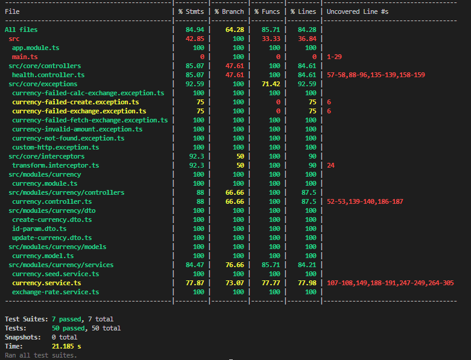
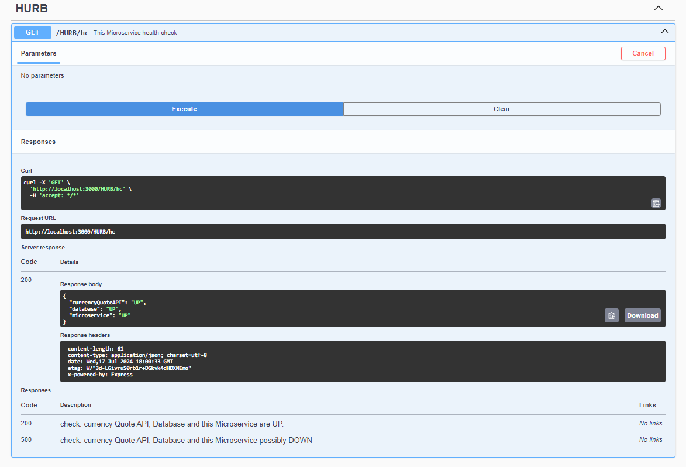
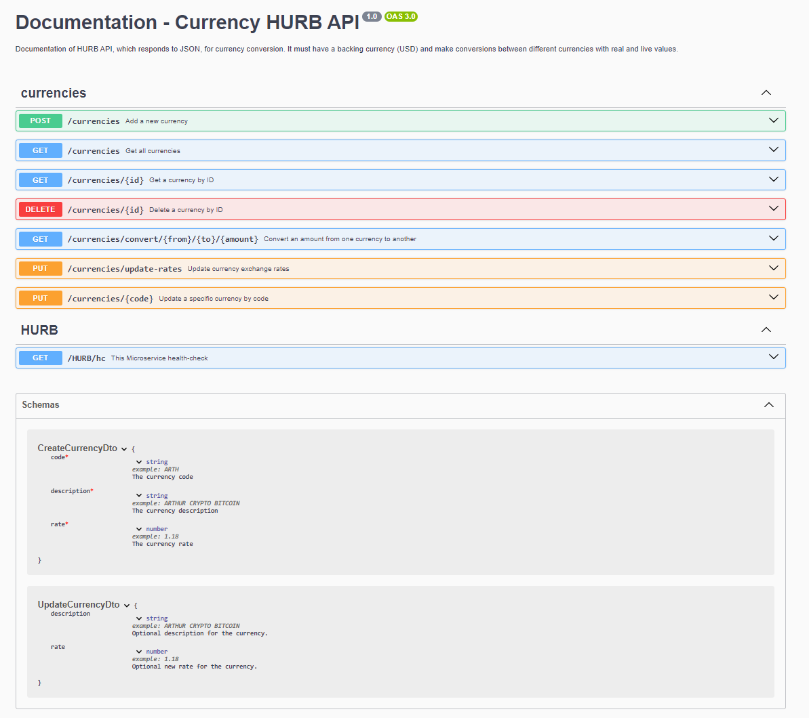
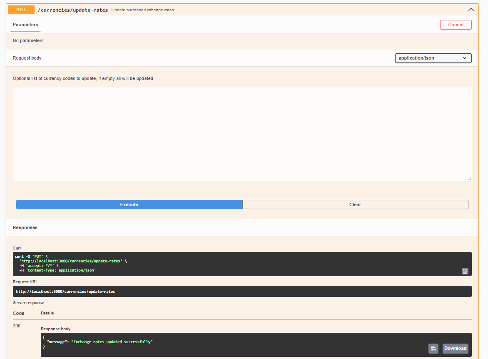
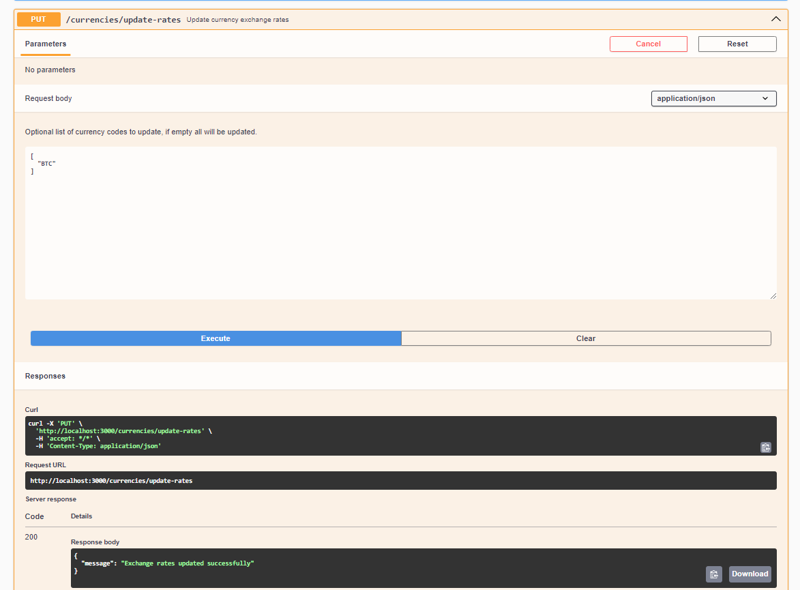

# HURB-Microservice-Currency
#  Desafio Bravo

[[English](README.md) | [Português](README.pt.md)]

Este projeto, **HURB-Currency**, é um microsserviço projetado para fornecer taxas de conversão de moedas em tempo real. Solucionamos este problema: Construir uma API, que responda a JSON, para conversão de moedas. Deve ter uma moeda de base (USD) e fazer conversões entre diferentes moedas com valores reais e ao vivo.

# Requisitos:
A API deve converter entre as seguintes moedas:

- USD
- BRL
- EUR
- BTC
- ETH
Outras moedas podem ser adicionadas conforme o uso.

Ex: USD para BRL, USD para BTC, ETH para BRL, etc...

A solicitação deve receber como parâmetros: A moeda de origem, o valor a ser convertido e a moeda final.

Ex: ?from=BTC&to=EUR&amount=123.45

Também construa um endpoint para adicionar e remover moedas suportadas pela API usando verbos HTTP.

A API deve suportar conversão entre FIAT, cripto e fictícias. Exemplo: BRL->HURB, HURB->ETH

"A moeda é o meio pelo qual as transações monetárias são efetivadas." (Wikipedia, 2021).

Portanto, é possível imaginar que novas moedas entrem em existência ou deixem de existir, também é possível imaginar moedas fictícias como as moedas de Dungeons & Dragons sendo usadas nessas transações, como quanto vale uma Peça de Ouro (Dungeons & Dragons) em Real ou quanto vale o GTA$1 em Real.

Vamos considerar a cotação da PSN onde GTA$1,250,000.00 custa R$83.50 claramente temos uma relação entre as moedas, então é possível criar uma cotação. (Playstation Store, 2021).

Ref: Wikipedia [Site Institucional]. Disponível em: https://pt.wikipedia.org/wiki/Moeda. Acesso em: 28 de abril de 2021. Playstation Store [Loja Virtual]. Disponível em: https://store.playstation.com/pt-br/product/UP1004-CUSA00419_00-GTAVCASHPACK000D. Acesso em: 28 de abril de 2021.

O código precisa rodar em macOS ou Ubuntu (preferencialmente como um contêiner Docker)

A API precisa suportar um volume de 1000 requisições por segundo em um teste de estresse.

A API precisa incluir cotações reais e atuais por meio de integração com APIs públicas de cotação de moedas

# Variáveis de Ambiente
Este projeto utiliza as seguintes variáveis de ambiente (.env):

| Nome                          | Descrição                              | Valor Padrão                                       |
| ----------------------------- | -------------------------------------- | -------------------------------------------------- |
| API_URL                       | API de Cotação de Moedas               | https://latest.currency-api.pages.dev/v1/currencies|
| MONGO_CONN                    | Conexão com Banco de Dados Mongo       | mongodb://localhost:27017/CurrencyDB               |

# Pré-requisitos
- Instale o [Node.js](https://nodejs.org/en/) versão executada no ambiente de desenvolvimento: `20.15.1`
- Instale o [Docker](https://docs.docker.com/engine/install/) versão executada no ambiente de desenvolvimento: `2.3.0.4`

# Começando
1. **Inicie a imagem docker do mongodb:**
    ```bash
    docker run --name mongodb --restart=always -d -p 27017:27017 mongodb/mongodb-community-server:6.0-ubi8
    ```    
2. **Clone o repositório:**
    ```bash
    git clone https://github.com/leoaidar/HURB-Currency
    ```
3. **Navegue até o diretório do projeto:**  
    ```bash
    cd currency-api
    ```
4. **Instale as dependências:**
    ```bash
    npm install
    ```
5. **Construa e execute o projeto:**
    ```bash
    npm start
    ```
6. **Acesse a aplicação via:**

    Navegue para <a href="http://localhost:3000" target="_blank">http://localhost:3000</a>
    
7. **Documentação da API:**

    Acesse o endpoint da Swagger UI em [http://localhost:3000/api](http://localhost:3000/api) para interagir com a documentação da API. Navegue para 

# Cenário: O código precisa rodar em macOS ou Ubuntu (preferencialmente como um contêiner Docker):
1. **Clone o repositório:**
    ```bash
    git clone https://github.com/leoaidar/HURB-Currency
    ```
2. **Navegue até o diretório do projeto:**  
    ```bash
    cd currency-api
    ```
3. **Inicie o docker-compose.yaml:**
    ```bash
    docker-compose up
    ```    

# Sobre o projeto: Node JS + TypeScript + Nest JS + Mongoose + MongoDB + Jest + Artillery + Swagger
Usei o NestJS, um excelente framework que já fornece algumas pré-configurações para Node.js com TypeScript, rotas, Injeção de Dependência e uma separação lógica clara entre as camadas do projeto, o que me poupou tempo de desenvolvimento, permitindo-me focar bastante nos requisitos funcionais e não funcionais do projeto. Não utilizei código boilerplate, apenas a criação inicial do projeto com "nest new currency-api"; toda a estrutura adicional e arquivos foram criados manualmente sem código boilerplate. Utilizei o MongoDB, um banco de dados NoSQL, e o Mongoose como ORM, já que é mais adequado para trabalhar com esse banco de dados, e criei um Seed para popular algumas moedas dentro do Banco de Dados. Os testes estão separados dos scripts principais em uma pasta específica de testes, utilizei o Jest para testes de unidade e integração, bem como testes de cobertura. Usei o Artillery para testes de estresse, que se integra muito bem ao Node.js e é configurável via arquivo YAML. Usei o Swagger (OpenAPI) para documentação ao vivo do microsserviço, e além disso, muito do código está comentado para melhor entendimento dos algoritmos. Quanto à arquitetura de software, a estrutura que escolhi é referida como uma estrutura modular ou estrutura baseada em domínio, especialmente adequada para aplicações que utilizam frameworks modernos. Ela é influenciada pelos princípios de Arquitetura Limpa(Clean Architecture) e Design Orientado ao Domínio(DDD), embora eu tenha simplificado para corresponder à escala e ao escopo dos microserviços de conversão de moedas.

## Estrutura do Projeto
A estrutura de pastas do `currency-api` é explicada abaixo:

| Nome                        | Descrição                                                                                     |
|-----------------------------|-----------------------------------------------------------------------------------------------|
| **src**                     | Contém todo o código-fonte da aplicação.                                                      |
| **src/commons**             | Utilidades comuns e funções auxiliares usadas em toda a aplicação.                            |
| **src/core**                | Funcionalidades centrais da aplicação, incluindo classes base e interfaces.                   |
| **src/core/controllers**    | Controladores para manipular requisições, incluindo o controlador de verificação de saúde.    |
| **src/core/exceptions**     | Exceções personalizadas para tratamento de erros em toda a aplicação.                         |
| **src/interfaces**          | Interfaces TypeScript para definir dados estruturados.                                        |
| **src/modules**             | Módulos divididos por funcionalidade ou característica, como moeda.                           |
| **src/modules/currency**    | Recursos relacionados à moeda, incluindo controladores, serviços e modelos.                   |
| **src/utils**               | Funções utilitárias específicas para a funcionalidade da aplicação.                           |
| **test**                    | Contém todos os testes da aplicação, incluindo testes de unidade e integração.                |
| **test/controllers**        | Testes para controladores.                                                                    |
| **test/services**           | Testes para serviços.                                                                         |
| **test/integration-tests/** | Teste de estresse.                                                                            |
| **test/interceptors**       | Testes para interceptadores.                                                                  |
| **stress_test.yml**         | Configuração para testes de estresse com o Artillery.                                         |
| **dist**                    | Contém os distribuíveis (ou saída) da compilação do TypeScript.                               |
| **node_modules**            | Contém todas as dependências npm.                                                             |
| **package.json**            | Contém dependências npm, bem como scripts de compilação.                                      |
| **tsconfig.json**           | Configurações para a compilação do código-fonte escrito apenas em TypeScript.                 |
| **tslint.json**             | Configurações para verificação de estilo de código TSLint.                                    |
 
Essa estrutura garante que cada parte da aplicação seja separada de uma maneira clara e lógica, aumentando a manutenibilidade e escalabilidade.

# Testes
1. **Temos Testes Unitários, Testes de Integração, Teste de Estresse, Relatório de Teste de Estresse, Relatório de Cobertura de Testes.**
    ```bash
    "jest": "29.5.0"
    "artillery": "2.0.17"
    ```
2. **Executando Testes Unitários e de Integração usando Scripts NPM + Jest:**  
    ```bash
    npm run test
    ```
3. **Executando Teste com Relatório de Cobertura usando Scripts NPM + Jest:**
    ```bash
    npm run test --coverage
    ```



4. **Executando Teste de Estresse com Relatório de Teste de Estresse usando Scripts NPM + Artillery:**
    ```bash
    npm start
    ```
5. **Inicie o Artillery no mesmo caminho do projeto (currency-api) mas em outro terminal:**
    ```bash
    npm install -g artillery
    artillery run stress_test.yml
    ```


# Endpoints principais

### Requisito: A requisição deverá receber como parâmetros: A moeda de origem, o valor a ser convertido e a moeda final:
**GET /currencies/convert/{from}/{to}/{amount}**
- Converter um valor de uma moeda para outra
 - Possível resposta:  ``{
  "value": 7442842.87
}``


Exemplo:
```
curl -X 'GET' \
  'http://localhost:3000/currencies/convert/BTC/EUR/123.45' \
  -H 'accept: */*'
```

#
### Requisito: crie também um endpoint para adicionar e remover moedas suportadas pela API usando verbos HTTP:
### Requisito: Portanto, é possível imaginar que novas moedas passem a existir ou deixem de existir, também é possível imaginar moedas fictícias como as moedas de Dungeons & Dragons sendo utilizadas nessas transações, como por exemplo quanto custa um Ouro Peça (Dungeons & Dragons) em Real ou quanto custa o GTA$1 em Real:
**POST /currencies**
- Adicione uma nova moeda
 - Possível resposta:  ``{
  "id": "50963882-f4ce-4e3d-a37d-8c1fcb918acb",
  "code": "HURB",
  "rate": 0.4,
  "description": "HURB CRYPTO"
}``


Exemplo:
```
curl -X 'POST' \
  'http://localhost:3000/currencies' \
  -H 'accept: */*' \
  -H 'Content-Type: application/json' \
  -d '{
  "code": "HURB",
  "description": "HURB CRYPTO",
  "rate": 0.40
}'
```
- Adicione uma nova moeda
 - Possível resposta:  ``{
  "id": "9e979014-c8b1-42b4-8b0e-13113e58e8f8",
  "code": "GTA$1",
  "rate": 2.5,
  "description": "GRAND THEFT AUTO CRYPTO"
}``


Exemplo:
```
curl -X 'POST' \
  'http://localhost:3000/currencies' \
  -H 'accept: */*' \
  -H 'Content-Type: application/json' \
  -d '{
  "code": "GTA$1",
  "rate": 2.5,
  "description": "GRAND THEFT AUTO CRYPTO"
}'
```


**DELETE /currencies/{id}**
- Excluir uma moeda por ID
 - Possível resposta:  ``{
  "message": "Currency deleted successfully"
}``


Exemplo:
```
curl -X 'DELETE' \
  'http://localhost:3000/currencies/9dbbad1e-9000-4162-b5a0-1dccd17dcf3d' \
  -H 'accept: */*'
```

#
### Requisito: A API deve suportar conversão entre FIAT, cripto e fictício. Exemplo: BRL->HURB, HURB->ETH:
**GET /currencies/convert/{from}/{to}/{amount}**
- BRL->HURB. Ele tentará converter na API de cotação de moeda, mas como é uma moeda fictícia, será calculado internamente.
 - Possível resposta:  ``{
  "value": 7.37
}``


Exemplo:
```
curl -X 'GET' \
  'http://localhost:3000/currencies/convert/BRL/HURB/100' \
  -H 'accept: */*'
```


- HURB->ETH. Ele tentará converter na API de cotação de moeda, mas como é uma moeda fictícia, será calculado internamente.
 - Possível resposta:  ``{
  "value": 0.07
}``


Exemplo:
```
curl -X 'GET' \
  'http://localhost:3000/currencies/convert/HURB/ETH/100' \
  -H 'accept: */*'
```

#
### Requisito: Portanto, é possível imaginar que novas moedas passem a existir ou deixem de existir, também é possível imaginar moedas fictícias como as moedas de Dungeons & Dragons sendo utilizadas nessas transações, como por exemplo quanto custa um Ouro Peça (Dungeons & Dragons) em Real ou quanto custa o GTA$1 em Real:
**GET /currencies/convert/{from}/{to}/{amount}**
- Converta um valor de uma moeda para outra. Ele tentará converter na API de cotação de moeda, mas como é uma moeda fictícia, será calculado internamente.
 - Possível resposta:  ``{
  "value": 217.04
}``


Exemplo:
```
curl -X 'GET' \
  'http://localhost:3000/currencies/convert/GTA%241/BRL/100' \
  -H 'accept: */*'
```

#
### Requisito: A API precisa incluir cotações reais e atuais através da integração com APIs de cotações de moedas públicas:
**GET /currencies/convert/{from}/{to}/{amount}**
- Converte um valor de uma moeda para outra. Como são conhecidas, as moedas são obtidas diretamente da API de cotação de moeda: [https://latest.currency-api.pages.dev/v1/currencies/usd.json](https://latest.currency-api.pages.dev/ v1/moedas/usd.json).
 - Possível resposta:  ``{
  "value": 54.26
}``


Exemplo:
```
curl -X 'GET' \
  'http://localhost:3000/currencies/convert/USD/BRL/10' \
  -H 'accept: */*'
```

# Health Check de Verificação de Saúde

### Esta verificação de saúde do microsserviço:

 - [http://localhost:3000/HURB/hc](http://localhost:3000/HURB/hc)

**GET /HURB/hc**
- `currencyQuoteAPI`: Faz uma solicitação a uma API externa usando Axios para verificar se a taxa de câmbio da moeda brasileira (BRL) está disponível e é válida.

- `database`: Conecta-se ao MongoDB, cria um registro temporário, recupera e exclui-o. Este método testa todas as funcionalidades básicas de CRUD.

- `microservice`: Faz uma chamada ao endpoint interno que lista as moedas para verificar se o microsserviço está operando corretamente.

 - Resposta possível:  ``{
  "currencyQuoteAPI": "UP",
  "database": "UP",
  "microservice": "UP"
}``

Exemplo:
```
curl -X 'GET' \
  'http://localhost:3000/HURB/hc' \
  -H 'accept: */*'
```



# Swagger

## Visão Geral dos Endpoints do Microsserviço de Moeda



# Endpoint Adicional de Atualização de Taxas em Lote

### Atualizar taxas de câmbio em lote:

**GET /currencies/update-rates**
- É possível atualizar uma moeda específica como ["BTC"] ou todas as moedas, apenas enviando um corpo vazio e atualizará as taxas de câmbio em lote.

 - Resposta possível:  ``{
  "message": "Exchange rates updated successfully"
}``

Exemplo:
```
curl -X 'PUT' \
  'http://localhost:3000/currencies/update-rates' \
  -H 'accept: */*' \
  -H 'Content-Type: application/json'
```





# TSLint
O TSLint é um linter de código que ajuda a detectar pequenos problemas de qualidade e estilo de código.

## Executando o TSLint
Para executar o TSLint, você pode chamar o script de construção principal ou apenas a tarefa TSLint.
```
npm run lint // executa apenas TSLint
```

## Licença

Nest é [licenciado pelo MIT](LICENÇA).