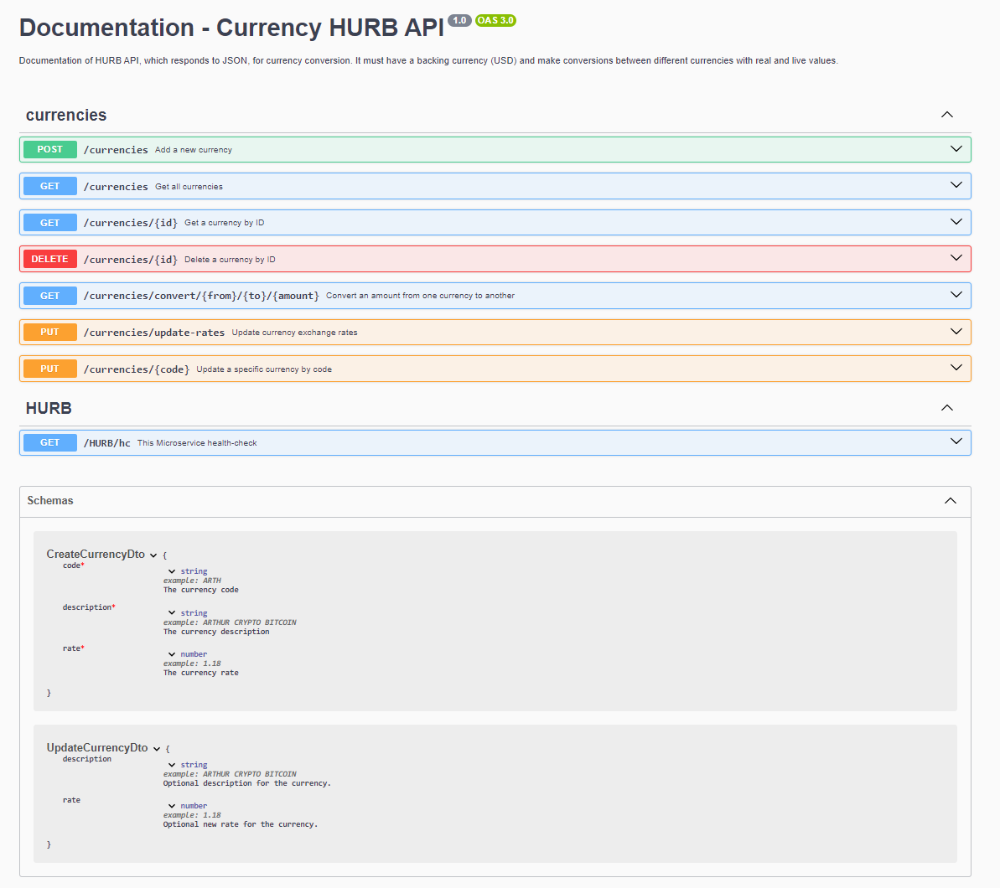

# HURB-Microservice-Currency
#  Bravo Challenge

This project, **HURB-Currency**, is a microservice designed to provide real-time currency conversion rates. We've solved this problem: Build an API, which responds to JSON, for currency conversion. It must have a backing currency (USD) and make conversions between different currencies with real and live val.

# Requirements:
The API must convert between the following currencies:

USD
BRL
EUR
BTC
ETH
Other coins could be added as usage.

Ex: USD to BRL, USD to BTC, ETH to BRL, etc...

The request must receive as parameters: The source currency, the amount to be converted and the final currency.

Ex: ?from=BTC&to=EUR&amount=123.45

Also build an endpoint to add and remove API supported currencies using HTTP verbs.

The API must support conversion between FIAT, crypto and fictitious. Example: BRL->HURB, HURB->ETH

"Currency is the means by which monetary transactions are effected." (Wikipedia, 2021).

Therefore, it is possible to imagine that new coins come into existence or cease to exist, it is also possible to imagine fictitious coins such as Dungeons & Dragons coins being used in these transactions, such as how much is a Gold Piece (Dungeons & Dragons) in Real or how much is the GTA$1 in Real.

Let's consider the PSN quote where GTA$1,250,000.00 cost R$83.50 we clearly have a relationship between the currencies, so it is possible to create a quote. (Playstation Store, 2021).

Ref: Wikipedia [Institutional Website]. Available at: https://pt.wikipedia.org/wiki/Currency. Accessed on: 28 April 2021. Playstation Store [Virtual Store]. Available at: https://store.playstation.com/pt-br/product/UP1004-CUSA00419_00-GTAVCASHPACK000D. Accessed on: 28 April 2021.

The code needs to run on macOS or Ubuntu (preferably as a Docker container)

The API needs to support a volume of 1000 requests per second in a stress test.

The API needs to include real and current quotes through integration with public currency quote APIs


# Environment vars
This project uses the following environment variables (.env):

| Name                          | Description                         | Default Value                                         |
| ----------------------------- | ------------------------------------| ------------------------------------------------------|
|API_URL                        | Currency Quote API                  | https://latest.currency-api.pages.dev/v1/currencies   |
|MONGO_CONN                     | Mongo Database Connection           | mongodb://localhost:27017/CurrencyDB                  |


# Pre-requisites
- Install [Node.js](https://nodejs.org/en/) version 20.15.1


# Getting started
1. **Clone the repository:**
    ```bash
    git clone https://github.com/leoaidar/HURB-Currency
    ```
2. **Navigate to the project directory:**  
    ```bash
    cd currency-api
    ```
3. **Install dependencies:**
    ```bash
    npm install
    ```
4. **Build and run the project:**
    ```bash
    npm start
    ```
5. **Access the application via:**

    Navigate to <a href="http://localhost:3000"  target="_blank">http://localhost:3000</a>
    
6. **API Documentation:**

    Access the Swagger UI endpoint at please [http://localhost:3000/api](http://localhost:3000/api)  to interact with the API documentation. Navigate to 
    

# About project: Node JS + TypeScript + Nest JS + Mongoose + MongoDB + Jest + Artillery + Swagger
I used NestJS, an excellent framework that already provides some pre-configurations for Node.js with TypeScript, routes, Dependency Injection, and a clear logical separation between the layers of the project, which saved me some development time allowing me to focus heavily on the functional requirements and non-functional requirements of the project. No boilerplate code was used, just the initial creation of the project with "nest new currency-api"; all further structure and files were manually created without boilerplate code. I utilized MongoDB, a NoSQL database, and Mongoose as the ORM since it's best suited for working with this database, it was created a Seed to populate some currencies inside Database. The tests are separated from main scripts at specific folder test, I employed Jest for unit and integration testing as well as coverage testing. I used Artillery for stress testing, which integrates very well with Node.js and is configurable via a YAML file. I used Swagger (OpenAPI) for live documentation of the microservice, and additionally, a lot of the code is commented for a better understanding of the algorithms. Regarding the software architecture, the structure I chose is referred to as a modular structure or domain-based structure, especially suited for applications using modern frameworks. It is influenced by the principles of Clean Architecture and Domain-Driven Design (DDD), although I simplified it to match the scale and scope of the currency conversion microservices.

## Project Structure
The folder structure of the `currency-api` is explained below:

| Name                        | Description                                                                                   |
|-----------------------------|-----------------------------------------------------------------------------------------------|
| **src**                     | Contains all the source code for the application.                                             |
| **src/commons**             | Common utilities and helper functions used across the application.                            |
| **src/core**                | Core functionalities of the application including base classes and interfaces.                |
| **src/core/controllers**    | Controllers to handle requests, including the health check controller.                        |
| **src/core/exceptions**     | Custom exceptions for error handling across the application.                                  |
| **src/interfaces**          | TypeScript interfaces to define structured data.                                              |
| **src/modules**             | Modules divided by feature or functionality such as currency.                                 |
| **src/modules/currency**    | Currency related features including controllers, services, and models.                        |
| **src/utils**               | Utility functions specific to the application's functionality.                                |
| **test**                    | Contains all tests for the application including unit and integration tests.                  |
| **test/controllers**        | Tests for controllers.                                                                        |
| **test/services**           | Tests for services.                                                                           |
| **test/integration-tests/** | Stress Test.                                                                                  |
| **test/interceptors**       | Tests for interceptors.                                                                       |
| **stress_test.yml**         | Configuration to stress tests with Artillery.                                                 |
| **dist**                    | Contains the distributable (or output) from your TypeScript build.                            |
| **node_modules**            | Contains all npm dependencies.                                                                |
| **package.json**            | Contains npm dependencies as well as build scripts.                                           |
| **tsconfig.json**           | Config settings for compiling source code only written in TypeScript.                         |
| **tslint.json**             | Config settings for TSLint code style checking.                                               |


This structure ensures that each part of the application is separated in a clear and logical manner, enhancing maintainability and scalability.

    currency-api/
    |-- src/
    |   |-- commons/
    |   |   |-- constants/
    |   |   |-- interfaces/
    |   |-- core/
    |   |   |-- base/
    |   |   |-- controllers/
    |   |   |   |-- health.controller.ts
    |   |   |-- decorators/
    |   |   |-- guards/
    |   |   |-- interceptors/
    |   |   |-- exceptions/
    |   |-- modules/
    |   |   |-- config/
    |   |   |-- currency/
    |   |   |   |-- controllers/
    |   |   |   |-- dto/
    |   |   |   |-- models/
    |   |   |   |-- services/
    |   |-- utils/
    |   |-- app.module.ts
    |   |-- main.ts
    |-- test/
    |   |-- controllers/
    |   |-- integration-tests/
    |   |-- interceptors/
    |   |-- services/
    |   |-- jest-e2e.json
    |-- node_modules/
    |-- dist/
    |-- stress_test.yml
    |-- package.json
    |-- tsconfig.json
    |-- .env
    |-- .gitignore
    |-- nest-cli.json
    |-- README.md
    

# Testing
1. **We have Unit Tests, Integration Tests, Stress Test, Report stress test, Test coverage Report.**
    ```bash
    "jest": "29.5.0"
    "artillery": "2.0.17"
    ```
2. **Running Unit Tests and Integration Tests using NPM Scripts + Jest:**  
    ```bash
    npm run test
    ```
3. **Running Test with Coverage Report using NPM Scripts + Jest:**
    ```bash
    npm run test --coverage
    ```
4. **Running Stress Test with Stress Test Report using NPM Scripts + Artillery:**
    ```bash
    npm start
    ```
5. **Start Artillery in the same project path(currency-api) but another terminal:**
    ```bash
    npm install -g artillery
    artillery run stress_test.yml
    ```

# Endpoints Highlights 

### Requirement: The request must receive as parameters: The source currency, the amount to be converted and the final currency:
**GET /currencies/convert/{from}/{to}/{amount}**
- Convert an amount from one currency to another
  - Possible Response:  ``{
  "value": 7442842.87
}``


Example:
```
curl -X 'GET' \
  'http://localhost:3000/currencies/convert/BTC/EUR/123.45' \
  -H 'accept: */*'
```

# 
### Requirement: Also build an endpoint to add and remove API supported currencies using HTTP verbs:
### Requirement: Therefore, it is possible to imagine that new coins come into existence or cease to exist, it is also possible to imagine fictitious coins such as Dungeons & Dragons coins being used in these transactions, such as how much is a Gold Piece (Dungeons & Dragons) in Real or how much is the GTA$1 in Real:
**POST /currencies**
- Add a new currency
  - Possible Response:  ``{
  "id": "50963882-f4ce-4e3d-a37d-8c1fcb918acb",
  "code": "HURB",
  "rate": 0.4,
  "description": "HURB CRYPTO"
}``


Example:
```
curl -X 'POST' \
  'http://localhost:3000/currencies' \
  -H 'accept: */*' \
  -H 'Content-Type: application/json' \
  -d '{
  "code": "HURB",
  "description": "HURB CRYPTO",
  "rate": 0.40
}'
```
- Add a new currency
  - Possible Response:  ``{
  "id": "9e979014-c8b1-42b4-8b0e-13113e58e8f8",
  "code": "GTA$1",
  "rate": 2.5,
  "description": "GRAND THEFT AUTO CRYPTO"
}``


Example:
```
curl -X 'POST' \
  'http://localhost:3000/currencies' \
  -H 'accept: */*' \
  -H 'Content-Type: application/json' \
  -d '{
  "code": "GTA$1",
  "rate": 2.5,
  "description": "GRAND THEFT AUTO CRYPTO"
}'
```


**DELETE /currencies/{id}**
- Delete a currency by ID
  - Possible Response:  ``{
  "message": "Currency deleted successfully"
}``


Example:
```
curl -X 'DELETE' \
  'http://localhost:3000/currencies/9dbbad1e-9000-4162-b5a0-1dccd17dcf3d' \
  -H 'accept: */*'
```

# 
### Requirement: The API must support conversion between FIAT, crypto and fictitious. Example: BRL->HURB, HURB->ETH:
**GET /currencies/convert/{from}/{to}/{amount}**
- BRL->HURB. It will trying to convert in the currency quote API, but how its as a fictitious currency, so it will be calc internally.
  - Possible Response:  ``{
  "value": 7.37
}``


Example:
```
curl -X 'GET' \
  'http://localhost:3000/currencies/convert/BRL/HURB/100' \
  -H 'accept: */*'
```


- HURB->ETH. It will trying to convert in the currency quote API, but how its as a fictitious currency, so it will be calc internally.
  - Possible Response:  ``{
  "value": 0.07
}``


Example:
```
curl -X 'GET' \
  'http://localhost:3000/currencies/convert/HURB/ETH/100' \
  -H 'accept: */*'
```

# 
### Requirement: Therefore, it is possible to imagine that new coins come into existence or cease to exist, it is also possible to imagine fictitious coins such as Dungeons & Dragons coins being used in these transactions, such as how much is a Gold Piece (Dungeons & Dragons) in Real or how much is the GTA$1 in Real:
**GET /currencies/convert/{from}/{to}/{amount}**
- Convert an amount from one currency to another. It will trying to convert in the currency quote API, but how its as a fictitious currency, so it will be calc internally.
  - Possible Response:  ``{
  "value": 217.04
}``


Example:
```
curl -X 'GET' \
  'http://localhost:3000/currencies/convert/GTA%241/BRL/100' \
  -H 'accept: */*'
```

# 
### Requirement: The API needs to include real and current quotes through integration with public currency quote APIs: 
**GET /currencies/convert/{from}/{to}/{amount}**
- Converts an amount from one currency to another. As they known currencies so get directly from currency quote API: "https://latest.currency-api.pages.dev/v1/currencies/usd.json".
  - Possible Response:  ``{
  "value": 54.26
}``


Example:
```
curl -X 'GET' \
  'http://localhost:3000/currencies/convert/USD/BRL/10' \
  -H 'accept: */*'
```


# Health Check Endpoint

### This Microservice health-check: 


**GET /HURB/hc**
- `currencyQuoteAPI`: Makes a request to an external API using Axios to verify that the Brazilian currency (BRL) exchange rate is available and valid.


- `database`: Connects to MongoDB, creates a temporary record, retrieves and deletes it. This method tests all basic CRUD functionality.


- `microservice`: Makes a call to the internal endpoint that lists the currencies to verify that the microservice is operating correctly.


  - Possible Response:  ``{
  "currencyQuoteAPI": "UP",
  "database": "UP",
  "microservice": "UP"
}``

Example:
```
curl -X 'GET' \
  'http://localhost:3000/HURB/hc' \
  -H 'accept: */*'
```


# Swagger

## Microservice Currency Endpoints



# TSLint
TSLint is a code linter that helps catch minor code quality and style issues.

## Running TSLint
To run TSLint you can call the main build script or just the TSLint task.
```
npm run lint  // runs only TSLint
```

## License

Nest is [MIT licensed](LICENSE).


